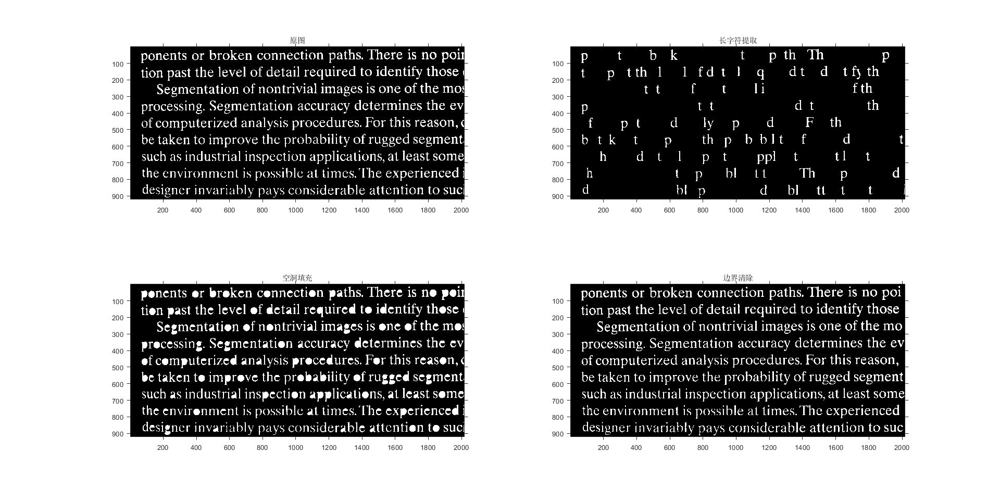
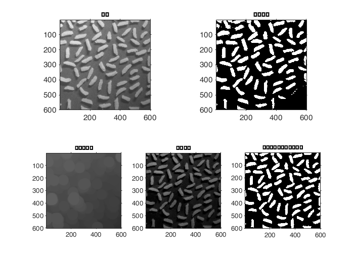
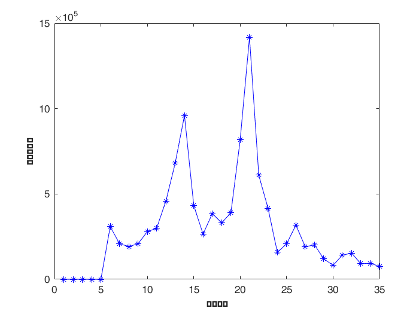
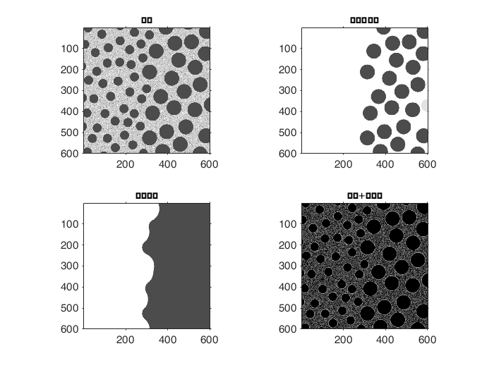

## 编程作业任务

* 二值形态学  
* 灰度级形态学

### 要求

* 自己实现基本操作函数(腐蚀、膨胀)，以及其组合运算(开启、闭合)  
* 图像读写等常用函数可以调用库函数  
* 编程语言不限，matlab、python、C/C++等均可

### 实验环境

windows 10， Matlab 2020b

## 文本图像的二值形态学处理

* 长字符提取：提取文本中在竖直方向上有较长连续像素的字母
* 空洞填充：填充文本中字母的空洞部分
* 边界清除：去除文本边界显示不完整的字母

主函数在Main_BinOperation.m中。

### 基本原理

#### 1. 腐蚀

A用B来腐蚀的过程是，B平移x后仍在A中的所有x的集合，所以腐蚀的操作需要对A进行子集划分，由于腐蚀操作的是二值数值，所以交集的判断可以根据矩阵对应位置的乘积之和来判断，若A_sub与B的点乘存在0值则放弃，反之则保留。需要注意的是B中可能存在0值点，所以可以通过增加B的补集来进行判断。

具体实现在My_erosion.m中。

#### 2. 膨胀

A用B来膨胀的过程是，先对B做关于原点的映射，再将其映像平移x，这里A与B的映像的交集不为空集。

由于膨胀同样操作的是二值数值，所以交集的判断可以根据矩阵对应位置的乘积之和来判断，又因为卷积操作中也需要对卷积核进行一次映像，即可以以卷积核为B来对A进行卷积操作。

具体实现在My_dilation.m中。

#### 3. 开启

先腐蚀后膨胀的过程，可以用来消除小物体、在纤细点处分离物体、平滑较大物体的边界的同时并不明显改变其面积。

开启运算通常是在需要去除小颗粒噪声，以及断开目标物体之间粘连时使用。其主要作用与腐蚀相似，与腐蚀操作相比，具有可以基本保持原目标原有大小不变的优点。

#### 4. 闭合

先膨胀后腐蚀的过程，用来填充物体内细小空洞、连接邻近物体、平滑其边界的同时并不明显改变其面积。

### 长字符提取

先通过开启操作获得图片中的长条状结构，对长条进行膨胀运算和与原图交运算，并通过多次迭代获得最终结果。因为需要向左右方向膨胀，所以结构元素需要设置成二维，注意宽度不易设置过大，不然容易出现跨字符保留现象。

具体实现在My_getletter.m中。

### 空洞填充

先对原图像求补，然后获取边界，再进行膨胀运算和与原图交运算，并通过迭代求收敛结果。

具体实现在My_fillhole.m中。

### 边界去除

获取原图的边界，然后通过对边界的膨胀运算和对原图的交运算求出边界图，然后将原图减去边界图即可以将边界去除。

具体实现在My_deleteboundary.m中。

### 结果显示

## 灰度级形态学

* 图像分割
* 粒度测定
* 纹理分割

主函数在Main_Gray.m中。

### 基本原理

#### 顶帽变换

f减去其开操作。

$$
T_{hat}(f) = f - (f \circ b)
$$

顶帽变换用于暗背景上的亮物体，一个重要的用途就是校正不均匀光照的映像。

#### 重构腐蚀和膨胀函数

因为二值形态学中的腐蚀和膨胀操作的元素是0和1，而灰度值的范围是0-255，所以需要重构腐蚀和膨胀函数。

具体实现在Dilation.m和Erosion.m中。

### 图像分割

首先对原图像使用半径为40的圆形结构元素进行开启操作，然后用原图减去开启操作得到的背景图像，这样照片的亮暗之间就不再存在极端的差别。

具体实现在T_hat.m中。

### 结果显示

### 粒度测定

对比背景亮并且具有规则形状的颗粒，该方法使用逐渐增大的结构元素来对图像执行开操作。

基本思想是，某个特殊尺度的开启运算应该对包含类似尺度的颗粒的输入图像的区域具有最大的影响。对于每次开启运算，计算该开启运算中像素值的和，该和称为表面区域，他会随结构元素的增大而减小，因为开启运算会降低亮特征的灰度。

具体实现在Detect.m中，GetElementEnty.m中实现获得圆形结构元素。
### 结果显示

### 纹理分割

原理：使用一个比小斑点大的结构元素对图像做闭操作，然后将这些斑点删除。之后使用尺度大于剩余这些斑点间的间隔的结构元素对该图像做开启运算，则最终结果应该是一副图像，该图像中，斑点间的亮间隔已被删除，留下暗色斑点，并且这些半点之间有暗色间隔。最后使用一个大小为3*3元素全1的结构元素来对图像执行形态学梯度操作，将给出区域间的边界。

具体实现在Segment.m中，Gradiant.m中实现梯度操作。

### 结果显示

