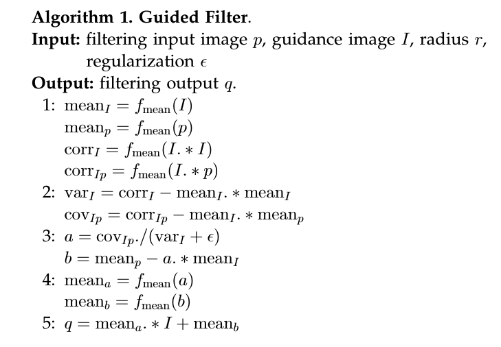

## 编程作业任务

* 图像去雾
  
### 要求

* 编程语言不限
* 不允许调用的库函数：导向滤波函数

### 实验环境

windows 10， Matlab 2020b

## 实验原理

复现[文章1](http://kaiminghe.com/publications/cvpr09.pdf)，使用[文章2](http://kaiminghe.com/eccv10/eccv10ppt.pdf)的导向滤波代替Soft Matting 获得refine t。

主函数在Main.m中。

### 暗通道

$$
J^{dark}(X) = \min_{c\in {r,g,b}} ( \min_{y \in \Omega(x)} (J^c(y)) ).
$$

首先比较RGB三个通道的颜色值，求其中最小值；然后比较3*3的邻域内的值，求最小值，用于代替中心像素的暗通道值。需要注意的是这里没有给图像加padding。

在GetDark.m中实现
### 大气光

先获得暗通道最亮的前0.1%的点的位置，然后在原图的这些位置中取最高强度像素的值代替大气光度。所以先把暗通道矩阵转为向量，然后通过maxk函数来获得最亮的点的位置，再去原图中比较强度。需要注意的是，比较强度的时候是将RGB图像转为灰度图像来进行比较。此外，由文章1中的公式12可知，求解$\hat t$时需要对RGB三通道进行最小值比较，所以大气光也需要生成三通道。

在GetAirLight.m中实现
### 参数t_hat

$$
\hat t(x) = 1-\omega \min_c (\min_{y \in \Omega(x)}(\frac{I^c(y)}{A^c})).
$$
先将原图和大气图像的三个通道进行拆分，按照求解暗通道一般，先求解单像素的三通道最小值，然后求解其3*3领域的最小值。如文章1所给出，$\omega$取0.95。

在GetT_hat.m中实现
### 导向滤波获得细化t

原文章1中使用的是soft matting 方法来细化t，但由于此法求解太过复杂，参考作者的另一文章2使用导向滤波来获得细化的t。

导向滤波算法如下：

在GuideFilter.m中实现
### 获得去雾图片

$$
J(x) = \frac{I(x) - A}{\max(t(x),t_0)} + A.
$$

$t_0$值参考文章1设置为0.1。

## 收获

深刻理解了基于先验的暗通道去雾算法的相关原理，也通过代码实现了去雾算法，最重要的通过阅读文章和理解算法感受到先验经验的重要性，也深知唯有何教授这般在一个领域深耕数年的人才能够发现这么简单又朴素的原理。