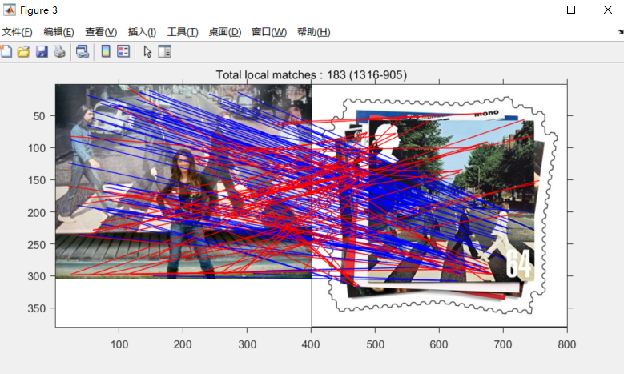
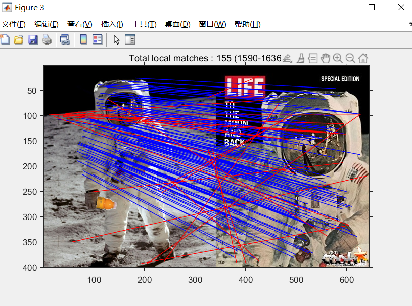
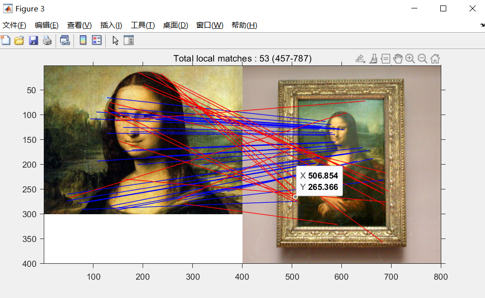
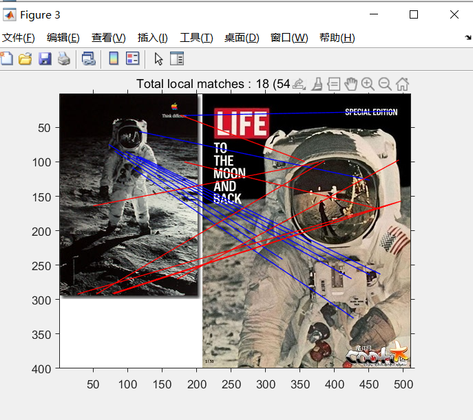

# 匹配几何校验

聂文尚 SA20218108

## 实验要求

1. 给定一对图像，利用提取好的SIFT特征文件，根据距离阈值准则（跨图像的局部SIFT特征距离小于0.4），得到图像间的初始局部特征匹配关系

2. 基于上述初步匹配结果，实现spatial coding方法，进行匹配校验，确定几何不一致的匹配

3. 将几何一致的匹配和不一致的匹配在图像上画出来，分别用蓝色和红色进行区分

## 实验步骤

1. 读取图片信息，读取图片得SIFT特征信息并进行归一化；
2. 对两幅图片的SIFT进行匹配，匹配的准则为最小距离不超过0.4；
3. 实现Spatial Code方法，进行匹配校验准备；
4. 根据第二步的结果将所有匹配的SIFT对进行蓝色连线；
5. 根据Spatial Code方法得到的结果，进行几何校验，将不满足的匹配对改成红色线。

## 实验结果

