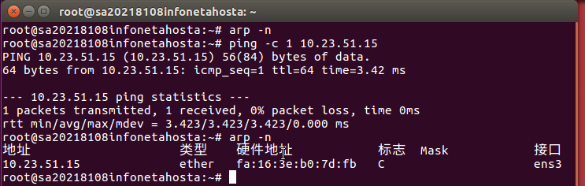
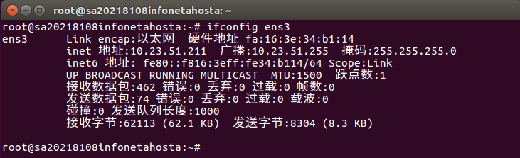
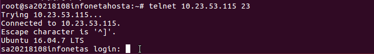

# 实验一 Linux的网络操作与配置

## 实验内容

### 1. 理解APR协议
1） 在HostA和HostB中分别打开一个终端用于本实验。

2） 在HostA和HostB中分别执行ifconfig ens3，查看并记录它们各自的IPv4地址、执行命令ifconfig ens5查看IPv6地址(global和link两种)以及以太网接口的物理地址。

3） 在 HostA 中执行命令 arp -n 或 ip neigh show 查看并记录本机 ARP 缓存表的内容。

ARP表为空

4） 在 HostA 中执行命令 ping –c 1 HostB 的 IPv4 地址 向 HostB 发送 ICMP 请求报文。收到ICMP 响应后再次执行命令 arp -n 或 ip neigh show 查看 HostA 的 ARP 缓存表的内容。

5） 在 HostA 的 ARP 缓存表里面可获得HostB 的 MAC 地址，记录下来，检查与 HostB 上 ifconfig ens3 命令的执行结果是否一致。

对比结果显示是一致的

6） 在 HostA 中执行命令 ping6 –c 1 6001：： 1，收到 ICMP 响应后继续执行命令 ip neigh show 查看 HostA 的 ARP 缓存表，记录结果。简要解释为何无法看到对应于地址6001：： 1 的 ARP 表项而只能得到网关的某网卡的 MAC 地址。 提示：思考网段 (链路)、广播域的概念

### 学习IP协议基本配置

1） 分别用命令 route -n 和命令 route --inet6 查看本机的 IPv4 和 IPv6 路由配置，记录所在子网的子网掩码/前缀长度，并与前面 ifconfig 的结果作比较。

2） 执行以下两个命令分别查看系统内核的 IPv4 和 IPv6 的 FORWARD 值，记录下来。简单解释这个值的含义以及为何这个值是这样设定的。提示：思考主机与路由器的区别。

命令 1： cat /proc/sys/net/ipv4/ip_forward
命令 2： cat /proc/sys/net/ipv6/conf/all/forwarding

###  3 TCP端口探测

1） 在终端 1 中执行命令 tac /etc/services 查看 Linux 操作系统中的端口与服务对应列表，并从其中找到 telnet 服务对应的端口，记录下来。

2） 在终端 1 中执行命令 telnet S的ipv4地址（这里需要打开S的控制台用ifconfig ens3查看）Port，这里的 Port 是上述查找到的端口， 记录执行结果。 (可能需要等待一段时间才能出现结果)

3） 在终端 2 中执行命令 netstat –aunt 来观察自己主机上的所有 TCP 与 UDP 连接状况，将输出的信息记录下来。请在上述记录的结果中找到对应于 telnet 连接的那条记录并解释这条记录的含义。

4）执行命令 telnet S的ipv4地址（同上） 100，记录命令执行结果。同样使用 netstat –aunt 来查看本机的连接状况，请判断这次 telnet 连接是否成功建立并简单说明原因。

### 问题

4. [问题] 现在有一个网段的 IP 地址和子网掩码分别为 202.38.75.0/255.255.255.192，请计算该网段中一共有多少个全局 IPv4 地址可供主机使用，或者说这个网络中有多少真正可分配的 IP 地址？

5. [问题] 实验中执行 ifconfig 查看 ens3 接口的配置信息时可以观察到一个重要的参数 MTU，请问这个值是多少？查询资料说明 MTU 参数的用途。

6. [问题] IPv6 地址长度是 IPv4 地址长度的 4 倍，不过在今后的纯 IPv6 网络环境中路由器的路由表的规模反而有望减小，请简单解释这是为什么？

7. [问题] 一条 TCP 连接靠哪几个参数标识？
