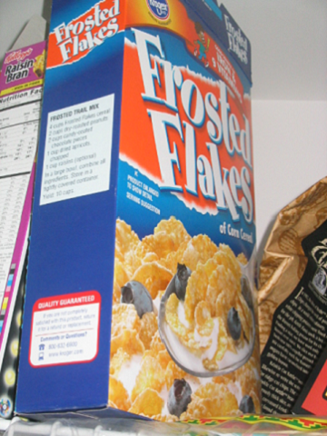
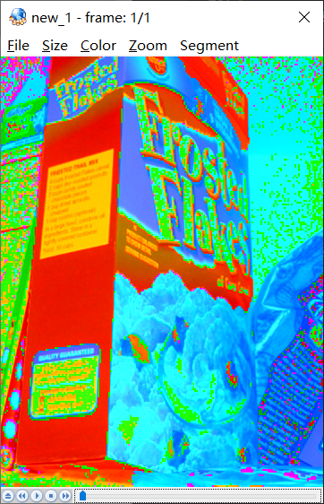
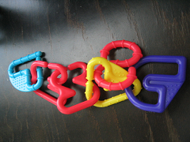
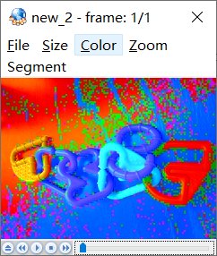

## 任务内容

第一次作业：C++实现图像读取和颜色空间转换 

（1）读取BMP图像，然后将RGB图像转换到YUV颜色空间并保存。

（2）不能调用现有的图像读取函数、颜色空间转换函数，代码自己编写。

## 实验环境

windows 10, CodeBlock
`.yuv`格式文件使用YUVPlayer展示，需要自动调整Size和Color

## BMP

位图文件(`Bitmap-File`)可看成由4个部分组成：位图文件头(`bitmap-file header`)、位图信息头(`bitmap-information header`)、彩色表(`color table`)和定义位图的字节【位图数据，即图像数据(`Data Bits`)或(`Data Body`)】阵列，它具有如下所示的形式。

位图文件的组成:
结构名称 | 符 号 | 大小(Byte)
-- |-- | - |
位图文件头 | BITMAPFILEHEADER bmfh | 14
位图信息头 | BITMAPINFOHEADER bmih | 40
彩色表 | RGBQUAD aColors[ ] | 由颜色索引数决定
位图数据 | BYTE aBitmapBits[ ] | 由图像尺寸决定

## YUV色彩空间

YUV是北美NTSC系统和欧洲PAL系统中模拟电视信号编码的基础。

在现代彩色电视系统中，通常采用三管彩色摄像机或彩色CCD摄影机进行取像，然后把取得的彩色图像信号经分色、分别放大校正后得到RGB，再经过矩阵变换电路得到亮度信号Y和两个色差信号U、V，最后发送端将亮度和两个色差总共三个信号分别进行编码，用同一信道发送出去。这种色彩的表示方法就是所谓的YUV色彩空间表示。

## RGB2YUV

Y = 0.299 * red + 0.587 * green + 0.114 * blue;
Cb =-0.148 * red - 0.289 * green + 0.437 * blue;
Cr = 0.615 * red - 0.515 * green - 0.100 * blue;

本次实验中采用YUV420格式向下采样处理。

## BMPStruct.h

定义数据结构以及函数声明

### 数据结构

1. BMP的文件头：
```C++
typedef struct tagBITMAPFILEHEADER{
    DWORD bfSize;//file size
    WORD bfReserved1;// reserved word1
    WORD bfReserved2;// reserver word2
    DWORD bfOffBits;// BMP data offset from the file header
}BITMAPFILEHEADER;// BMP header 14Byte
```

2. BMP的信息头：
```C++
typedef struct tagBITMAPINFOHEADER{
    DWORD biSize;//Info Header size
    LONG biWidth;//pho width
    LONG biHeight;//pho height
    WORD biPlanes;//planes = 1
    WORD biBitCount;//pixel size
    DWORD biCompression;//compression type
    DWORD biSizeImage;//compression pho size
    LONG biXPelsPerMeter;//horizontal resolution
    LONG biYPelsPerMeter;//vertical resolution
    DWORD biClrUsed;
    DWORD biClrImportant;
}BITMAPINFOHEADER;//BMP INFO HEADER 40Byte
```

3. 彩色表：
```C++
typedef struct tagRGBQUAD{
    BYTE rgbBlue;
    BYTE rgbGreen;
    BYTE rgbRed;
    BYTE rgbReserved;
}RGBQUAD;
```

4. 图像数据：
```C++
typedef struct tagIMAGEDATA{
    BYTE blue;
    BYTE green;
    BYTE red;
}IMAGEDATA;
```
5. BMP的IMAGEDATA转YUV
```C++
typedef struct tagBMPData{
    LONG width;
    LONG height;
    IMAGEDATA **imagedata;
}BMPDATA;
```
### 函数

1. 显示BMP的文件头信息
```C++
void showBMPHead(BITMAPFILEHEADER pBMPHead);
```
2. 显示BMP的信息头信息
```C++
void showBmpInfoHead(BITMAPINFOHEADER pBMPInfoHead);
```
3. 读取BMP的IMAGEDATA数据
```C++
BMPDATA ReadBMPFileImageData(char *strFile);
```
4. RGB转YUV
```C++
void RGB2YUV(char *strFile);
```
函数实现均在BMPStruct.cpp文件中。

## 操作流程

主函数调用RGB2YUV函数，RGB2YUV调用ReadBMPFIle函数，其中调用showBMPHead和showBmpInfoHead显示读取文件头信息和信息头信息。

## 结果显示

输入1：


输出1：


输入2：


输出2：



## 总结

1. 一开始没注意到BMP的IMAGEDATA数据是从左下角开始读取，导致输出的YUV格式图像出现镜像现象；  
2. YUV的格式很多，选择YUV420是因为可以对图像进行压缩，比直接换算YUV444更好； 
