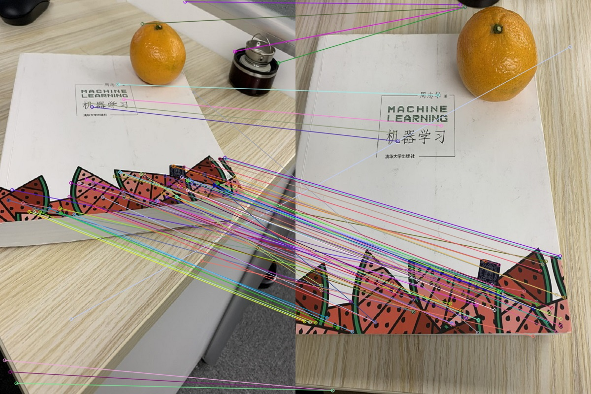
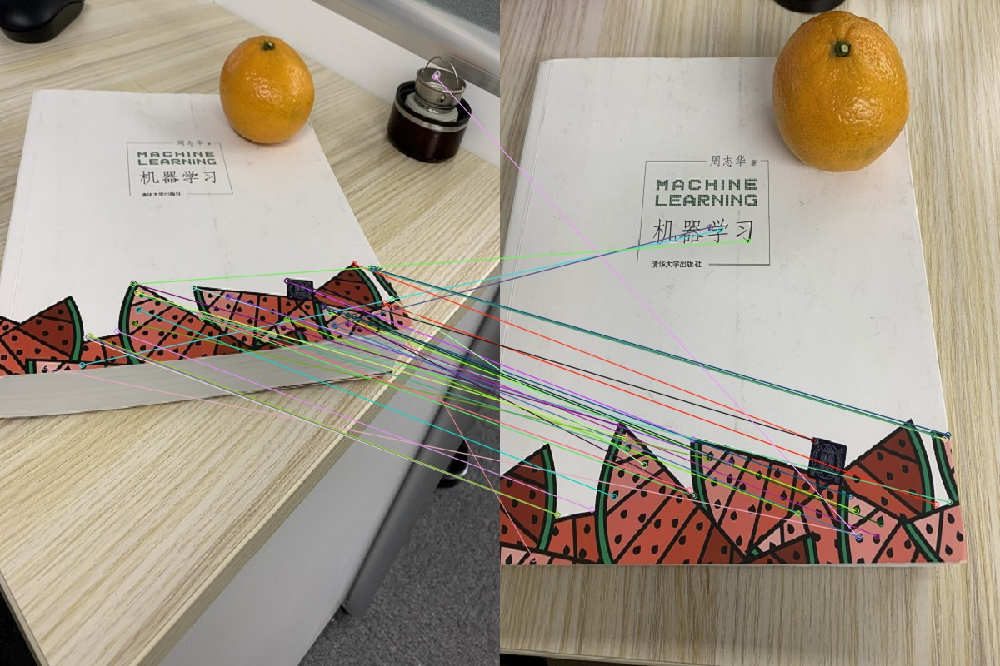

## 任务内容

基于图片SIFT和ORB特征，实现两幅相似图像匹配，提交源码

## 实验环境

windows 10,  
python 3.5.4,  
opencv-python 3.4.1.15,  
opencv-contrib-python 3.4.1.15,  
PyCharm Edu 2020.2.2 x64 

## 实验报告

调用opencv库函数，实现对两张图片的SIFT和ORB特征提取和匹配，并展示除结果。

选取图片如下：

### 结果展示

基于SIFT特征的结果

基于ORB特征的结果

### 源码详见 main.py